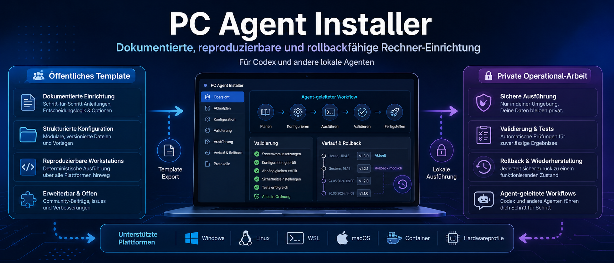

# PC Agent Installer

🌐 Languages: [Deutsch](README.md) | [English](README.en.md)



<p align="center">
  <a href="https://github.com/adrianweidig/pc-agent-installer/actions/workflows/validate.yml"></a>
  <a href="LICENSE"></a>
  <a href="https://github.com/adrianweidig/pc-agent-installer/issues"></a>
  <a href="https://github.com/adrianweidig/pc-agent-installer/pulls"></a>
</p>

<p align="center">
  <strong>A public template for documented, reproducible, and rollback-capable PC setup with Codex or other local agents.</strong>
</p>

<p align="center">
  <a href="#quick-start">Quick Start</a> ·
  <a href="#working-model">Working Model</a> ·
  <a href="#internationalization">Internationalization</a> ·
  <a href="#validation">Validation</a> ·
  <a href="docs/en/index.md">Documentation</a> ·
  <a href="CONTRIBUTING.en.md">Contributing</a> ·
  <a href="SECURITY.en.md">Security</a>
</p>

## Overview

PC Agent Installer is an agent workspace. A user clones this template, starts Codex in the repository, and lets the agent inspect, document, and validate the machine setup based on `AGENTS.md`, templates, and guard scripts.

The target model is an agent that replaces a real system administrator for the first setup of a freshly installed PC or server. For that job Codex must be started with a deliberately chosen full-access profile. Without Administrator, root, sudo, or matching runtime-admin rights, the installer can only analyze or prepare work and must not report a complete setup.

The project intentionally separates two worlds:

- **public template:** generic templates, scripts, schemas, examples, documentation, and safety rules
- **private operational work:** real host data, baselines, rollbacks, local infrastructure information, and secret references

The repository is not primarily a manual admin tool. The normal flow is agent-first: read rules, detect repository mode, check visibility, decide public/private scope, then make small and reviewable changes.

Full access is the intended operating mode for real first-run setup, but it is not permission to act blindly. The agent must still document current state, target state, risk, rollback path, validation, and explicit user approval before system-impacting changes.

## What This Template Provides

| Area | Purpose |
| --- | --- |
| Repository guards | Safely distinguish `template`, `operational`, and `local-only` modes |
| Visibility checks | Prevent host data from being written into a public repository |
| Templates | Numbered agent steps for Windows, Linux, WSL, macOS, containers, and hardware profiles |
| Baseline and change helpers | Document host state in private or local operational repositories |
| Validation | Check structure, frontmatter, script syntax, encoding, secret patterns, and Git diff whitespace |
| Documentation | Explain the agent-first flow, security model, rollback concept, and workspace hygiene |
| Internationalization | Provide German as the default language, English as an alternative language, and UTF-8/Unicode checks |
| Product components i18n | Provide product-facing module names and summaries centrally in twelve languages |

## Limits

- In `template` mode, host data must not be written.
- Plaintext secrets, tokens, private keys, production kubeconfigs, and raw credential dumps are forbidden.
- The project has no package manager, external runtime dependency, or classic build step.
- System-impacting changes belong only in confirmed private `operational` repositories or a `local-only` clone.

## Quick Start

```powershell
git clone https://github.com/adrianweidig/pc-agent-installer.git
cd pc-agent-installer
```

Start Codex or a comparable local agent in this directory and give it a natural task, for example:

For analysis, a normal profile is enough. For real OS setup, start the agent with the target platform's full-access profile first; see [docs/23-codex-root-profil.md](docs/23-codex-root-profil.md).

```text
Codex, read this repository and start the agent configuration for my PC.
Codex, in this directory: start the first-run configuration.
Codex, reopen the agent configuration and disable Docker recommendations.
```

The agent should derive the flow itself. It reads `AGENTS.md` and `Vorlage/common/00-agent-regeln.md`, checks Git status, repository mode, visibility, and open issues, decides between public template work and private operational work, and only then opens the matching configuration workflow.

## Discoverable Tools

| Purpose | PowerShell | Bash |
| --- | --- | --- |
| Detect repository mode | `./scripts/common/detect-repo-mode.ps1` | `bash ./scripts/common/detect-repo-mode.sh` |
| Verify template | `./scripts/common/verify-template.ps1` | `bash ./scripts/common/verify-template.sh` |
| Check host write permissions | `./scripts/common/assert-private-repo.ps1` | `bash ./scripts/common/assert-private-repo.sh` |
| Start or reopen agent configuration | `./scripts/common/first-run-config.ps1` | `bash ./scripts/common/first-run-config.sh` |
| Check host work readiness | `./scripts/common/assert-first-run-config.ps1` and `./scripts/common/assert-infrastructure-snapshot.ps1` | `bash ./scripts/common/assert-first-run-config.sh` and `bash ./scripts/common/assert-infrastructure-snapshot.sh` |
| Show product components for a language | `./scripts/common/list-product-components.ps1 -Language es` | `bash ./scripts/common/list-product-components.sh es` |

`assert-private-repo.*` may intentionally fail in public `template` mode. That is a safety boundary, not a template defect.

## Working Model

1. The user creates a copy of this template.
2. The user starts Codex or a comparable agent in the repository.
3. The agent reads `AGENTS.md` and `Vorlage/common/00-agent-regeln.md`.
4. The agent checks repository mode, Git status, visibility, and open issues.
5. The agent decides whether a change belongs in the public template or in a private operational structure.
6. The agent makes changes in small, documented, verifiable, and rollback-capable steps.

Official template changes stay in the public repository. Real machine state, local test goals, infrastructure details, and secret references belong in a private `operational` repository or a `local-only` clone.

## Repository Modes

| Mode | Purpose | Host data | Remote |
| --- | --- | --- | --- |
| `template` | public template | forbidden | public allowed |
| `operational` | private operations documentation | allowed, without plaintext secrets | private required |
| `local-only` | local working clone without remote | allowed, without plaintext secrets | no remote |

The current mode is stored in `repo-mode.yaml`.

## Internationalization

German is the default language of this project. English is maintained as the primary alternative language for international users. GitHub does not automatically translate the normal repository view by visitor language, so this repository uses visible language links and separate files:

- `README.md` is the German default README.
- `README.en.md` is the English README.
- `docs/` remains the German default documentation.
- `docs/de/index.md` is the German documentation entry point.
- `docs/en/index.md` is the English documentation entry point.
- Community files have German defaults and English alternatives where the content is relevant internationally.

The first-run configuration supports a stored language setting in `hosts/<HOSTNAME>/state/first-run-config.yaml`. Language resolution follows this order: explicit script parameter, stored project configuration, `PC_AGENT_LANG`, then German as the stable fallback. UTF-8 is preserved throughout; template validation checks German umlauts and the PowerShell/Bash i18n helpers.

Product components such as repository guards, first-run configuration, infrastructure snapshot, validation suite, and template upstream sync are additionally localized centrally in twelve languages: `de`, `en`, `es`, `fr`, `it`, `pt`, `nl`, `pl`, `tr`, `ru`, `zh-Hans`, and `ja`. The catalog lives in `i18n/product-components.tsv` and is checked by `validate-product-i18n.*`.

See [docs/en/I18N.md](docs/en/I18N.md) for details. The German version is [docs/I18N.md](docs/I18N.md).

## Project Structure

```text
AGENTS.md              binding work rules for Codex and other agents
Vorlage/               numbered agent templates
scripts/common/        repository mode, visibility, validation, i18n, and mode switching
scripts/powershell/    Windows host, baseline, and change helpers
scripts/bash/          Linux, WSL, macOS, and Unix-oriented helpers
scripts/container/     container, Compose, Swarm, Kubernetes, Podman, and NVIDIA detection
schemas/               YAML schemas for host, baseline, change, rollback, and repository mode data
i18n/                  product component catalog and language list
docs/                  German default documentation plus multilingual entry points
examples/              safe example artifacts without real host data
private.example/       examples for private configuration and secret references
hosts/                 remains empty in the template and contains only .gitkeep
Dockerfile             generic GHCR validation image for the public template
```

## Requirements

- Git
- PowerShell for Windows workflows
- Bash for Linux, WSL, macOS, and Unix-oriented workflows
- Optional: Docker to build the GHCR validation image locally
- Optional: GitHub CLI `gh` for GitHub visibility checks or private copy creation

## Validation

Before changes:

```powershell
git status --short --branch
./scripts/common/detect-repo-mode.ps1
```

After template changes:

```powershell
./scripts/common/verify-template.ps1
```

Also useful:

```bash
bash ./scripts/common/detect-repo-mode.sh
bash ./scripts/common/verify-template.sh
```

The relevant checks are bundled in `verify-template.*`: guard scripts, template structure, YAML frontmatter, PowerShell/Bash syntax, i18n tests, product component i18n, encoding, secret scanning, and Git diff whitespace.

## Documentation

Language entry points: [Deutsch](docs/de/index.md) | [English](docs/en/index.md)

Important German source documents are listed in [README.md](README.md#dokumentation). The English entry point summarizes the same structure and links to the canonical German documents where no full English page exists yet.

Product component localization is documented in [docs/en/product-components.md](docs/en/product-components.md).

## Contributing

Contributions are welcome if they keep the public/private boundary clean. Helpful contributions include robust guard scripts, better template validation, clearer documentation, safe examples without real host data, and reproducible bug reports.

Read [CONTRIBUTING.en.md](CONTRIBUTING.en.md) before opening a pull request. Security-sensitive information must not be posted in public issues; follow [SECURITY.en.md](SECURITY.en.md).

## Security

This repository must not contain plaintext secrets. If you find sensitive data or suspect a vulnerability, do not post confidential details publicly. Follow [SECURITY.en.md](SECURITY.en.md).

## License

The public template is licensed under the [Apache License 2.0](LICENSE). Private operational repositories, host data, local infrastructure information, and user content created from the template are not part of the public upstream project.

## Status

Current readiness is documented in [CODEX_PROJECT_READINESS.md](CODEX_PROJECT_READINESS.md). Planned releases are tracked in [CHANGELOG.md](CHANGELOG.md) and [docs/RELEASE_PROCESS.md](docs/RELEASE_PROCESS.md).
