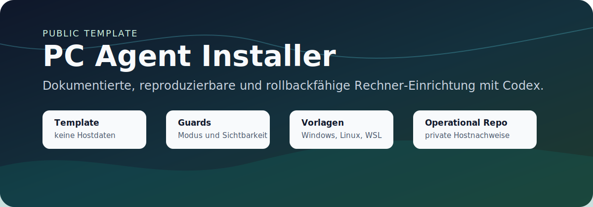

# PC Agent Installer



<p align="center">
  <a href="https://github.com/adrianweidig/pc-agent-installer/actions/workflows/validate.yml"></a>
  <a href="LICENSE"></a>
  <a href="https://github.com/adrianweidig/pc-agent-installer/issues"></a>
  <a href="https://github.com/adrianweidig/pc-agent-installer/pulls"></a>
</p>

<p align="center">
  <strong>Ein öffentliches Template für dokumentierte, reproduzierbare und rollbackfähige Rechner-Einrichtung mit Codex oder anderen lokalen Agenten.</strong>
</p>

<p align="center">
  <a href="#schnellstart">Schnellstart</a> ·
  <a href="#arbeitsmodell">Arbeitsmodell</a> ·
  <a href="#validierung">Validierung</a> ·
  <a href="docs/ARCHITECTURE.md">Architektur</a> ·
  <a href="CONTRIBUTING.md">Mitwirken</a> ·
  <a href="SECURITY.md">Security</a>
</p>

## Überblick

PC Agent Installer ist eine Agenten-Arbeitsbasis: Ein Nutzer klont dieses Template, startet Codex im Repository und lässt den Agenten anhand von `AGENTS.md`, Vorlagen und Guard-Skripten prüfen, dokumentieren und validieren.

Das Projekt trennt bewusst zwei Welten:

- **öffentliches Template:** generische Vorlagen, Skripte, Schemas, Beispiele, Dokumentation und Sicherheitsregeln
- **private Operational-Arbeit:** echte Hostdaten, Baselines, Rollbacks, lokale Infrastrukturinformationen und Secret-Referenzen

Das Repository ist nicht primär als manuell bedientes Admin-Tool gedacht. Der normale Ablauf ist agentenorientiert: Regeln lesen, Repo-Modus prüfen, Sichtbarkeit bewerten, Public/Private-Einordnung treffen, dann klein und nachvollziehbar arbeiten.

## Was dieses Template leistet

| Bereich | Zweck |
| --- | --- |
| Repo-Guards | `template`, `operational` und `local-only` sicher unterscheiden |
| Sichtbarkeitsprüfung | verhindern, dass Hostdaten in ein öffentliches Repository geschrieben werden |
| Vorlagen | numerische Agenten-Schritte für Windows, Linux, WSL, Container und Hardwareprofile |
| Baseline- und Change-Hilfen | Hostzustände in privaten oder lokalen Operational-Repositories dokumentieren |
| Validierung | Struktur, Frontmatter, Skript-Syntax, Encoding, Secret-Pattern und Git-Diff prüfen |
| Dokumentation | Agenten-first-Ablauf, Sicherheitsmodell, Rollback-Konzept und Workspace-Hygiene beschreiben |

## Grenzen

- Im Modus `template` werden keine Hostdaten geschrieben.
- Klartext-Secrets, Tokens, private Schlüssel, produktive Kubeconfigs und rohe Credential-Dumps sind verboten.
- Es gibt keinen Paketmanager, keine externen Laufzeitabhängigkeiten und keinen klassischen Build-Schritt.
- Systemwirksame Änderungen gehören nur in bestätigte private `operational`-Repositories oder in einen `local-only`-Klon.

## Schnellstart

```powershell
git clone https://github.com/adrianweidig/pc-agent-installer.git
cd pc-agent-installer
```

Danach Codex oder einen vergleichbaren lokalen Agenten im geklonten Repository starten und zuerst `AGENTS.md` lesen lassen.

Repo-Modus prüfen:

```powershell
./scripts/common/detect-repo-mode.ps1
```

```bash
bash ./scripts/common/detect-repo-mode.sh
```

Template validieren:

```powershell
./scripts/common/verify-template.ps1
```

```bash
bash ./scripts/common/verify-template.sh
```

Host-Schreibrechte prüfen:

```powershell
./scripts/common/assert-private-repo.ps1
```

```bash
bash ./scripts/common/assert-private-repo.sh
```

Im öffentlichen `template`-Modus schlägt `assert-private-repo` absichtlich fehl. Das ist eine Sicherheitsgrenze und schützt vor versehentlichem Schreiben von Hostdaten.

## Arbeitsmodell

Der normale Nutzerfluss:

1. Nutzer erstellt eine eigene Kopie dieses Templates.
2. Nutzer startet Codex oder einen vergleichbaren Agenten im Repository.
3. Der Agent liest `AGENTS.md` und `Vorlage/common/00-agent-regeln.md`.
4. Der Agent prüft Repo-Modus, Git-Status, Sichtbarkeit und offene Issues.
5. Der Agent entscheidet, ob eine Änderung ins öffentliche Template oder in eine private Operational-Struktur gehört.
6. Der Agent führt Änderungen klein, dokumentiert, überprüfbar und rollbackfähig aus.

Offizielle Template-Änderungen bleiben im öffentlichen Repository. Reale Rechnerzustände, lokale Testziele, Infrastrukturdetails und Secret-Referenzen gehören in ein privates `operational`-Repository oder einen `local-only`-Klon.

## Betriebsmodi

| Modus | Zweck | Hostdaten | Remote |
| --- | --- | --- | --- |
| `template` | öffentliches Template | verboten | öffentlich erlaubt |
| `operational` | private Betriebsdokumentation | erlaubt, ohne Klartext-Secrets | privat erforderlich |
| `local-only` | lokaler Arbeitsklon ohne Remote | erlaubt, ohne Klartext-Secrets | kein Remote |

Der aktuelle Modus steht in `repo-mode.yaml`.

## Private Nutzung

Private Operational-Kopie über GitHub CLI erzeugen:

```powershell
./scripts/common/create-private-copy.ps1 -Template owner/pc-agent-installer -Destination user/pc-agent-installer-private
```

Lokalen Operational-Modus ohne Remote aktivieren:

```powershell
./scripts/common/enable-local-only-mode.ps1
```

Danach kann in einer sicheren Operational-Umgebung eine Host-Baseline erzeugt werden:

```powershell
./scripts/powershell/collect-baseline.ps1
```

## Projektstruktur

```text
AGENTS.md              verbindliche Arbeitsregeln für Codex und andere Agenten
Vorlage/               numerisch sortierte Agenten-Vorlagen
scripts/common/        Repo-Modus, Sichtbarkeit, Validierung und Moduswechsel
scripts/powershell/    Windows-Host-, Baseline- und Change-Hilfen
scripts/bash/          Linux-, WSL- und Unix-nahe Hilfen
scripts/container/     Container-, Compose-, Swarm-, Kubernetes-, Podman- und NVIDIA-Erkennung
schemas/               YAML-Schemas für Host-, Baseline-, Change-, Rollback- und Repo-Modus-Daten
docs/                  Konzept-, Sicherheits-, Betriebs- und Validierungsdokumentation
examples/              sichere Beispielartefakte ohne echte Hostdaten
private.example/       Beispiele für private Konfigurationen und Secret-Referenzen
hosts/                 bleibt im Template leer und enthält nur .gitkeep
```

## Voraussetzungen

- Git
- PowerShell für Windows-Workflows
- Bash für Linux-, WSL- und Unix-nahe Workflows
- Optional: GitHub CLI `gh`, wenn GitHub-Sichtbarkeit geprüft oder eine private Kopie erzeugt werden soll

## Validierung

Vor Änderungen:

```powershell
git status --short --branch
./scripts/common/detect-repo-mode.ps1
```

Nach Template-Änderungen:

```powershell
./scripts/common/verify-template.ps1
```

Zusätzlich sinnvoll:

```bash
bash ./scripts/common/detect-repo-mode.sh
bash ./scripts/common/verify-template.sh
```

Die relevanten Projektchecks sind in `verify-template.*` gebündelt: Guard-Skripte, Template-Struktur, YAML-Frontmatter, PowerShell-/Bash-Syntax, Encoding, Secret-Scan und Git-Diff-Prüfung.

## Dokumentation

| Thema | Dokument |
| --- | --- |
| Konzept | [docs/00-konzept.md](docs/00-konzept.md) |
| Public vs. Private | [docs/01-public-template-vs-private-operational-repo.md](docs/01-public-template-vs-private-operational-repo.md) |
| Private Kopie | [docs/02-private-repo-erzeugen.md](docs/02-private-repo-erzeugen.md) |
| Sichtbarkeits-Guard | [docs/03-repo-visibility-guard.md](docs/03-repo-visibility-guard.md) |
| Sicherheitsmodell | [docs/04-sicherheitsmodell.md](docs/04-sicherheitsmodell.md) |
| Secrets Policy | [docs/05-secrets-policy.md](docs/05-secrets-policy.md) |
| Rollback-Konzept | [docs/08-rollback-konzept.md](docs/08-rollback-konzept.md) |
| Architektur | [docs/ARCHITECTURE.md](docs/ARCHITECTURE.md) |
| CI/CD | [docs/CI_CD.md](docs/CI_CD.md) |
| Test- und Validierungsmodell | [docs/13-test-und-validierungsmodell.md](docs/13-test-und-validierungsmodell.md) |
| Codex-Arbeitsmodell | [docs/12-codex-arbeitsmodell.md](docs/12-codex-arbeitsmodell.md) |
| Workspace-Konsolidierung | [docs/14-codex-workspace-konsolidierung.md](docs/14-codex-workspace-konsolidierung.md) |
| FAQ | [docs/99-faq.md](docs/99-faq.md) |
| Release-Prozess | [docs/RELEASE_PROCESS.md](docs/RELEASE_PROCESS.md) |
| Codex-New-Project-Standard | [docs/CODEX_NEW_PROJECT_STANDARD.md](docs/CODEX_NEW_PROJECT_STANDARD.md) |
| Maintainer-Checkliste | [docs/MAINTAINER_CHECKLIST.md](docs/MAINTAINER_CHECKLIST.md) |
| Support | [SUPPORT.md](SUPPORT.md) |
| Code of Conduct | [CODE_OF_CONDUCT.md](CODE_OF_CONDUCT.md) |

## Mitwirken

Beiträge sind willkommen, solange sie den Public/Private-Schnitt sauber halten. Besonders hilfreich sind:

- robuste Guard-Skripte
- bessere Template-Validierung
- klarere Dokumentation
- sichere Beispiele ohne echte Hostdaten
- reproduzierbare Fehlerberichte

Bitte lies [CONTRIBUTING.md](CONTRIBUTING.md), bevor du einen Pull Request öffnest. Sicherheitsrelevante Hinweise gehören nicht in öffentliche Issues; nutze die Hinweise in [SECURITY.md](SECURITY.md).

Für Support-Erwartungen und öffentliche Issue-Grenzen siehe [SUPPORT.md](SUPPORT.md). Für den Umgang miteinander gilt [CODE_OF_CONDUCT.md](CODE_OF_CONDUCT.md).

## Security

Dieses Repository darf keine Klartext-Secrets enthalten. Wenn du versehentlich sensible Daten findest oder eine Schwachstelle vermutest, poste keine vertraulichen Details öffentlich. Folge stattdessen [SECURITY.md](SECURITY.md).

## Lizenz

Das öffentliche Template steht unter der [Apache License 2.0](LICENSE). Private Operational-Repositories, Hostdaten, lokale Infrastrukturinformationen und Nutzerinhalte, die aus dem Template entstehen, sind nicht Teil des öffentlichen Upstream-Projekts.

## Status

Der aktuelle Readiness-Stand ist in [CODEX_PROJECT_READINESS.md](CODEX_PROJECT_READINESS.md) dokumentiert. Für geplante Veröffentlichungen siehe [CHANGELOG.md](CHANGELOG.md) und [docs/RELEASE_PROCESS.md](docs/RELEASE_PROCESS.md).

Für neue Projekte ist der wiederverwendbare Standard in [docs/CODEX_NEW_PROJECT_STANDARD.md](docs/CODEX_NEW_PROJECT_STANDARD.md) dokumentiert. Das unterstützende Bootstrap-Skript liegt unter [scripts/apply-codex-project-standard.sh](scripts/apply-codex-project-standard.sh).

Wenn dieses Template dir hilft, öffne gern ein Issue mit Feedback oder schlage eine kleine, überprüfbare Verbesserung per Pull Request vor.
