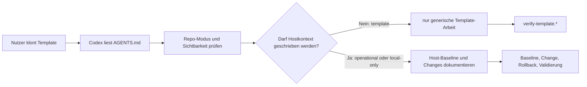

# Architektur

## Zweck

PC Agent Installer ist kein laufender Dienst, sondern ein skript- und dokumentationsbasiertes Template. Die Architektur trennt öffentliche, wiederverwendbare Agentenlogik von privaten Operational-Daten.

## Hauptkomponenten

## Repository-Schichten

| Schicht | Pfad | Aufgabe |
| --- | --- | --- |
| Agent-Regeln | `AGENTS.md`, `Vorlage/common/` | verbindlicher Ablauf für lokale Agenten |
| Repo-Guards | `scripts/common/` | Modus, Sichtbarkeit, Template-Struktur und Sicherheitsgrenzen prüfen |
| Host-Hilfen | `scripts/powershell/`, `scripts/bash/` | Windows-, Linux-, WSL-, macOS- und Unix-nahe Plattformen erkennen, Baselines erfassen, Change-Einträge schreiben |
| Container-Hilfen | `scripts/container/` | Docker, Compose, Swarm, Kubernetes, Podman und NVIDIA-Umfelder erkennen |
| Datenmodelle | `schemas/` | YAML-Strukturen für Host-, Baseline-, Change-, Rollback- und Secret-Referenzdaten |
| Dokumentation | `docs/`, `README.md`, `SECURITY.md` | Arbeitsmodell, Sicherheit, Rollback, Validierung und Maintainer-Hinweise |
| Beispiele | `examples/`, `private.example/` | sichere Beispielartefakte ohne echte Hostdaten |
| Operational-Ziel | `hosts/` | im Template leer; in sicheren Klonen Ziel für Hostnachweise |

## Repo-Modi

### `template`

Öffentlicher Modus. `hosts/` bleibt leer und enthält nur `.gitkeep`. Hostdaten, sensible Kontextdaten und Secret-Werte sind verboten.

### `operational`

Privater Remote-Modus. Hostdaten und Secret-Referenzen sind erlaubt, Klartext-Secrets bleiben verboten. Die Sichtbarkeit muss geprüft sein.

### `local-only`

Lokaler Git-Modus ohne Remote. Hostdaten sind erlaubt, solange keine Klartext-Secrets gespeichert werden und vor einem späteren Push erneut geprüft wird.

## Validierungsfluss

`verify-template.*` bündelt die schnelle Repository-Prüfung:

1. Repo-Modus erkennen
2. Pflichtstruktur prüfen
3. Template-Frontmatter prüfen
4. PowerShell- oder Bash-Syntax prüfen
5. Encoding und typische Secret-Pattern prüfen
6. Git-Diff-Whitespace prüfen

CI führt diesen Fluss auf Windows und Ubuntu aus.

## Erweiterungspunkte

- neue Vorlagen unter `Vorlage/` mit eindeutiger numerischer Position und gültigem Frontmatter
- neue Plattform- oder Tool-Erkennung unter `scripts/powershell/`, `scripts/bash/` oder `scripts/container/`
- neue Datenstrukturen unter `schemas/`
- zusätzliche Dokumentation unter `docs/`

## Sicherheitsgrenzen

- Das öffentliche Template darf keine echten Hostdaten enthalten.
- `assert-private-repo.*` ist eine Schreibschutzgrenze für Hostdaten.
- Secret-Werte werden weder im öffentlichen Template noch in privaten Operational-Repositories gespeichert.
- Destruktive Aktionen werden nur als dokumentierte, freigabepflichtige Schritte modelliert.

## Nicht-Ziele

- kein zentraler Agentenserver
- kein Paketmanager-Projekt
- kein Produkt-Installer mit automatischer produktiver Ausführung
- keine Speicherung produktiver Secrets
- keine automatische Bereinigung oder Migration ohne vorherige Validierung
